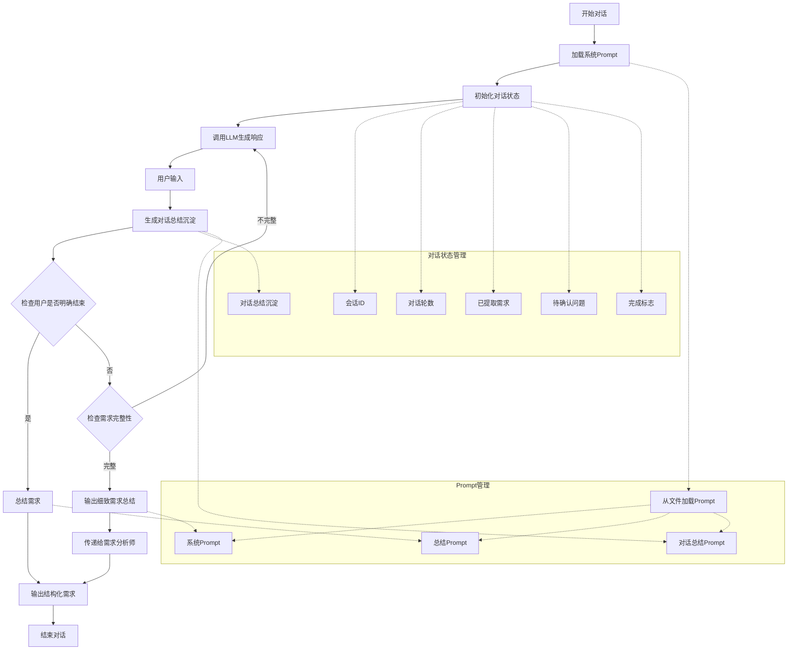

# 对话引导者Agent工作流程

## 工作流程说明

1. **开始对话**：用户启动与Agent的对话
2. **加载系统Prompt**：从文件中加载预定义的系统提示和总结提示
3. **初始化对话状态**：创建会话ID，初始化对话轮数、需求列表、待确认问题等
4. **调用LLM生成响应**：使用LangChain调用大模型（通义千问）生成响应
5. **用户输入**：用户提供需求相关的输入
6. **生成对话总结沉淀**：每轮对话后生成并存储对话总结，包括当前需求要点、缺失信息和下一步引导方向
7. **检查用户是否明确结束**：仅当用户明确输入"结束"、"完成"或"退出"时结束对话
   - 如果是，进入需求总结阶段
   - 如果否，继续判断需求完整性
8. **检查需求完整性**：根据5W1H标准判断需求是否完整（What、Who、Why、How）
   - 如果完整，输出细致的需求总结
   - 如果不完整，返回调用LLM生成响应，继续引导用户补充信息
9. **传递给需求分析师**：将完整的需求总结传递给需求分析师进行进一步拆解
10. **总结需求**：当对话结束时，使用预定义的总结Prompt生成结构化需求
11. **输出结构化需求**：将总结的需求以JSON格式输出
12. **结束对话**：对话完成

## 关键组件

- **Prompt管理**：Prompt内容与Agent代码分离，包括系统Prompt、总结Prompt和对话总结Prompt，便于维护和修改
- **对话状态管理**：使用LangGraph的状态管理功能，保存对话历史、上下文、对话轮数、需求列表、待确认问题和对话总结沉淀
- **需求完整性判断**：基于5W1H标准（What、Who、Why、How）自动判断用户需求是否完整
- **对话总结沉淀**：每轮对话后自动生成并存储对话总结，作为判断和后续处理的依据
- **大模型集成**：使用环境变量配置通义千问API，支持灵活切换
- **工作流控制**：使用LangGraph的图结构控制对话流程，包括需求引导、总结沉淀和需求传递
- **需求传递准备**：将完整的需求总结准备好，可直接传递给需求分析师进行进一步拆解

## 环境变量配置

Agent从`.env`文件中读取大模型配置：
- `QWEN_URL`：通义千问API地址
- `QWEN_APIKEY`：通义千问API密钥