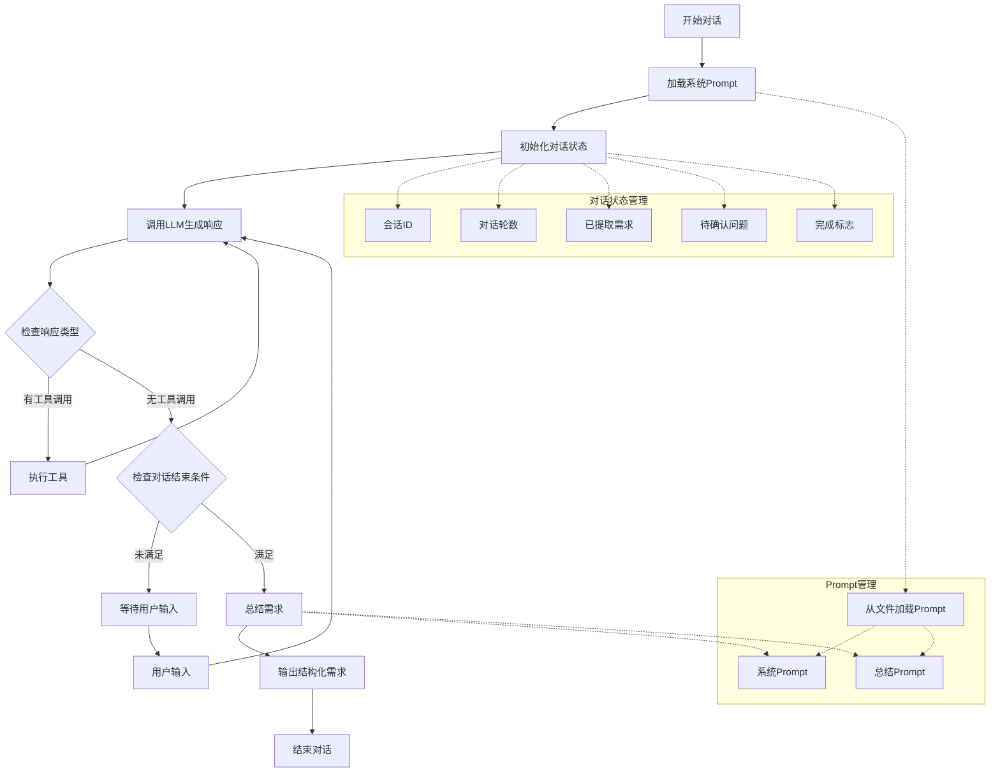

# 对话引导者Agent工作流程

## 工作流程说明

1. **开始对话**：用户启动与Agent的对话
2. **加载系统Prompt**：从文件中加载预定义的系统提示
3. **初始化对话状态**：创建会话ID，初始化对话轮数、需求列表、待确认问题等
4. **调用LLM生成响应**：使用LangChain调用大模型（通义千问）生成响应
5. **检查响应类型**：
   - 如果有工具调用，执行工具并继续
   - 如果没有工具调用，检查对话是否应该结束
6. **检查对话结束条件**：
   - 对话轮数≥20
   - 用户明确表示结束
   - 需求覆盖率≥80%
7. **等待用户输入**：Agent等待用户的下一条消息
8. **总结需求**：当对话结束时，使用预定义的总结Prompt生成结构化需求
9. **输出结构化需求**：将总结的需求以JSON格式输出
10. **结束对话**：对话完成

## 关键组件

- **Prompt管理**：Prompt内容与Agent代码分离，便于维护和修改
- **对话状态管理**：使用LangGraph的状态管理功能，保存对话历史和上下文
- **大模型集成**：使用环境变量配置通义千问API，支持灵活切换
- **工作流控制**：使用LangGraph的图结构控制对话流程

## 环境变量配置

Agent从`.env`文件中读取大模型配置：
- `QWEN_URL`：通义千问API地址
- `QWEN_APIKEY`：通义千问API密钥